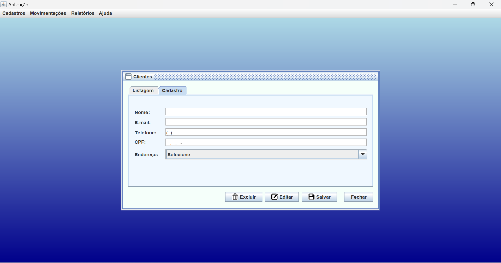
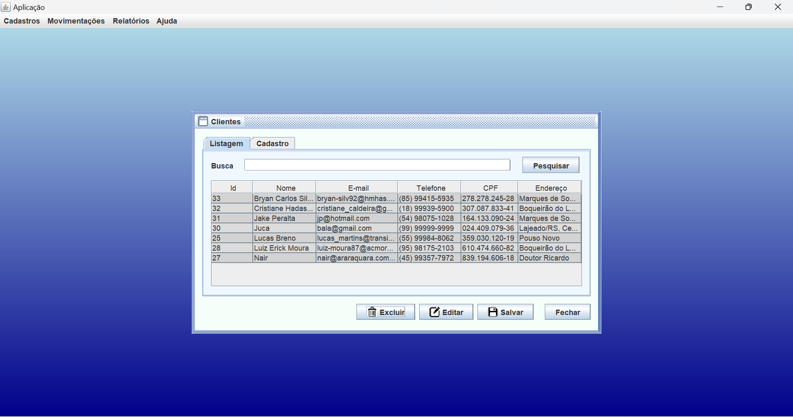
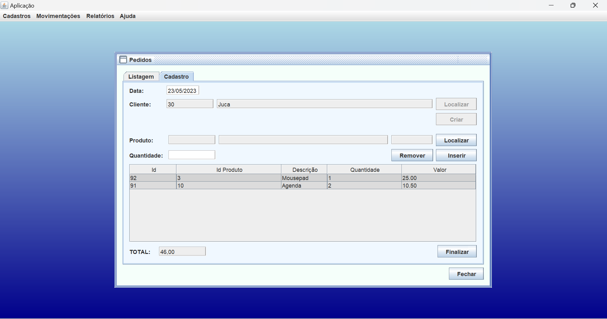

# Projeto de Vendas

Este projeto foi desenvolvido na faculdade de Análise e Desenvolvimento de Sistemas, com o objetivo de simular um sistema genérico de vendas de mercadorias. A aplicação foi criada utilizando Java e NetBeans, com PostgreSQL como banco de dados, e inclui funcionalidades para cadastro de endereços, clientes, produtos e pedidos, além de geração de relatórios em PDF usando JasperReports.

## Funcionalidades Principais

- **Cadastro de Endereço:** Possibilidade de cadastrar novos endereços.
- **Cadastro de Cliente:** Cadastro de clientes vinculados a endereços já existentes.
- **Cadastro de Produto:** Cadastro de novos produtos com gerenciamento de estoque.
- **Cadastro de Pedido:** Realização de vendas selecionando clientes e produtos, com verificação de estoque e cálculo do preço total.
- **Geração de Relatórios em PDF:** Relatórios de pedidos por cliente e intervalos de datas.

## Tecnologias Utilizadas

- **Java**: Linguagem de programação principal.
- **NetBeans IDE**: Ambiente de desenvolvimento integrado.
- **PostgreSQL**: Banco de dados relacional.
- **Java Swing**: Para criação das interfaces gráficas.
- **JasperReports**: Para geração de relatórios em PDF.

## Imagens do Projeto

### Cadastro de Clientes

### Listagem de Clientes

### Cadastro de Pedido

